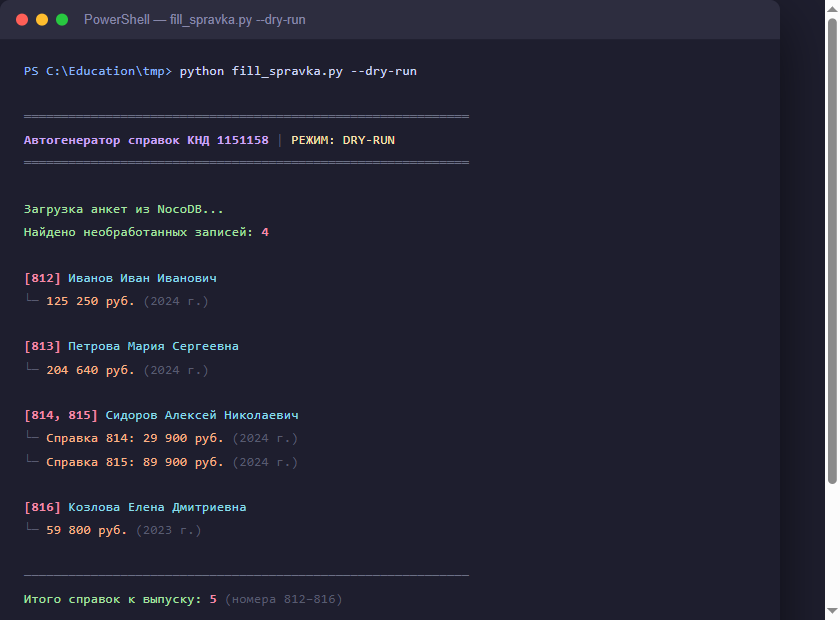
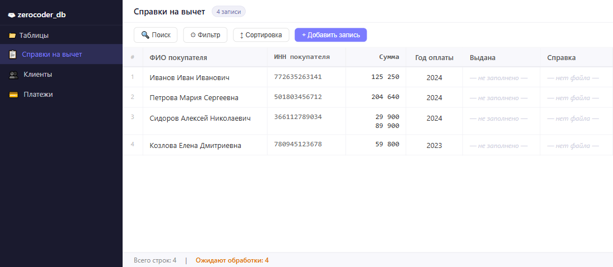
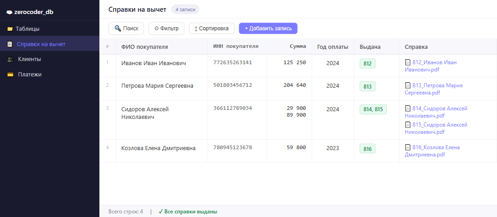

# Автогенератор справок для налогового вычета

Учебный проект по автоматизации формирования справок об оплате образовательных услуг (форма КНД 1151158) для клиентов онлайн-школы.

---

## Зачем это нужно

Каждый клиент онлайн-школы, который хочет получить налоговый вычет за обучение, должен предоставить в налоговую справку по форме КНД 1151158. При ручном заполнении это означает:

- одинаковые повторяющиеся действия для каждого клиента;
- высокий риск опечаток и неверно заполненных полей;
- необходимость выдавать несколько справок на одного клиента, если оплат было несколько.

Автогенератор решает все три проблемы.

---

## Как работает

```
ВХОД                    ОБРАБОТКА               ВЫХОД
Анкета клиента:   →     Автозаполнение     →    Готовый PDF:
ФИО, ИНН, сумма,        полей справки           Справка КНД 1151158
период обучения         по шаблону              для клиента
```

**Шаги обработки:**

1. Получает анкету клиента — ФИО, ИНН, сумму оплаты, период обучения.
2. Проверяет входные данные: корректность ИНН, наличие дат, числовые значения.
3. Преобразует данные в структуру, соответствующую требованиям формы КНД 1151158.
4. Заполняет все обязательные реквизиты по правилам ФНС.
5. Генерирует PDF-файл, готовый к передаче клиенту.

---

## Технологии

| Инструмент | Назначение |
|---|---|
| **Python** | Основная логика и оркестрация процесса |
| **PyMuPDF (fitz)** | Заполнение PDF-формы и генерация итогового документа |
| **NocoDB** | База данных для хранения анкет клиентов (self-hosted) |

Все данные обрабатываются локально — персональные данные клиентов не передаются на внешние серверы.

---

## Что реализовано (MVP)

- [x] Запуск в ручном режиме — бухгалтер запускает генерацию по каждому запросу
- [x] Поддержка нескольких платежей — на каждый платёж создаётся отдельная справка
- [x] Готовый PDF на выходе, подписанный и с печатью организации
- [x] Автоматическая проверка новых анкет в базе данных
- [ ] Автоматическая отправка готовых справок на email клиента
- [ ] Уведомления о статусе обработки

---

## Файлы в репозитории

| Файл | Описание |
|---|---|
| `Автогенератор справок налоговый вычет.pptx` | Презентация проекта |
| `Пример справки — Иванов Иван Иванович.pdf` | Пример заполненной справки КНД 1151158 (вымышленные данные) |

---

## Скриншоты

**Терминал — запуск в режиме dry-run:**



**NocoDB до запуска** — анкеты ждут обработки:



**NocoDB после запуска** — номера справок проставлены, PDF прикреплены:



## Пример результата

В файле [`Пример справки — Иванов Иван Иванович.pdf`](Пример%20справки%20—%20Иванов%20Иван%20Иванович.pdf) — готовая двухстраничная справка КНД 1151158:

- **Страница 1** — данные налогоплательщика, сумма расходов, подпись и печать организации.
- **Страница 2** — данные обучаемого (заполняется, если налогоплательщик и обучаемый — разные лица).

---

## Для кого

Проект разработан для финансово-юридического отдела онлайн-школы. Основные пользователи — финансист и бухгалтер, которые обрабатывают запросы клиентов на получение налогового вычета.

---

*Учебный проект · 2026*
